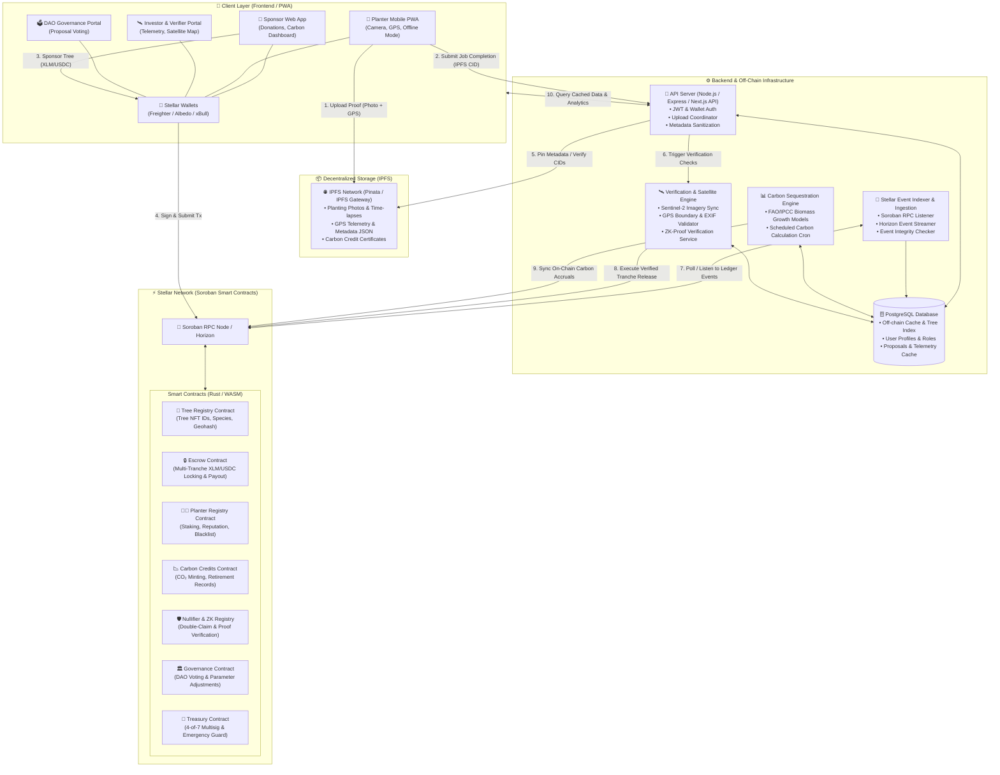
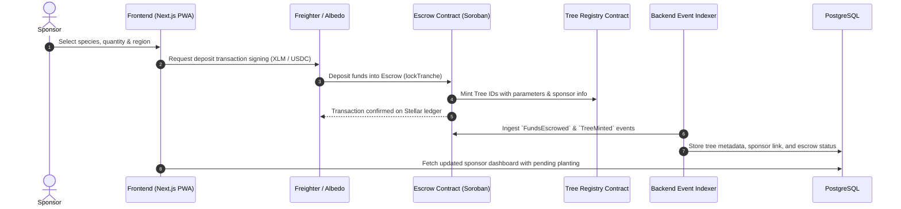
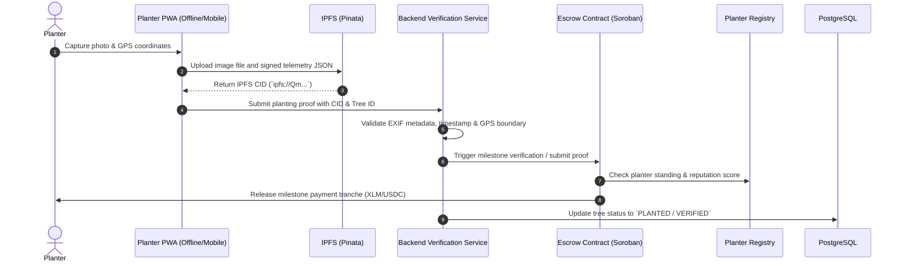
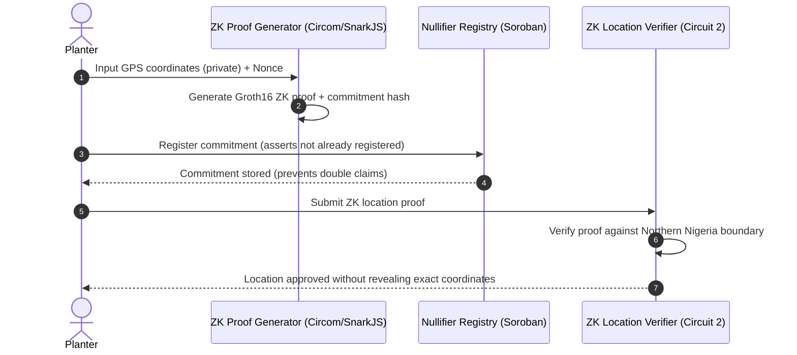

# 🏛️ Architecture Documentation — FarmCredit / Harvesta

> **High-Level System Architecture, Component Specifications, and Data Flows**  
> **Stellar Network (Soroban) • Next.js 15 PWA • PostgreSQL • IPFS**

---

## 1. High-Level System Architecture

---

## 2. End-to-End Data Flows

### Flow A: Tree Sponsorship & Escrow Lock

---

### Flow B: Planter Work Submission, IPFS Pinning & Payout

---

### Flow C: ZK Location Proof & Double-Claim Nullifier

---

## 3. Component Deep Dive

| Component Layer | Technologies Used | Key Responsibilities |
| :--- | :--- | :--- |
| **Frontend** | Next.js 15, React 19, TypeScript, Tailwind CSS v4, shadcn/ui, Workbox PWA | • **Atomic UI Architecture** (Atoms, Molecules, Organisms, Templates) • **Offline Support** via Service Workers for field planters • **Stellar Wallet Bridge** (Freighter, Albedo, xBull) • **Interactive Dashboards** (Sponsor impact, Investor Telemetry, Satellite Map) |
| **Smart Contracts** | Rust, Soroban SDK, WebAssembly (WASM), Stellar CLI | • **`tree_registry`**: Tamper-proof on-chain tree NFT identity, geohashes, and lifecycle state • **`escrow`**: Non-custodial escrow holding sponsor funds and distributing multi-tranche milestone payouts • **`planter_registry`**: Planter onboarding, application staking, reputation scoring, and blacklisting • **`carbon_credits`**: On-chain minting and retirement records of verified CO₂ offsets • **`nullifier_registry` / `zk_verifier`**: Zero-knowledge proof validation to prevent replay and spoofing • **`treasury`**: 4-of-7 multisig governance vault with emergency thresholds |
| **Backend & Off-Chain** | Node.js, Express, Next.js API Routes, PostgreSQL, Stellar Horizon/RPC SDK | • **Event Indexer**: Listens to Soroban events and maintains relational state in PostgreSQL • **Carbon Engine**: Computes sequestration rates via FAO/IPCC Tier 1 biomass growth models • **Verification & Oracles**: Integrates Sentinel-2 satellite imagery, GPS boundary checks, and image integrity verification • **Storage Generator**: Pre-signed URLs for sensitive certificates and assets |
| **Decentralized Storage (IPFS)** | IPFS, Pinata SDK, Helia | • Immutable decentralized storage for planter raw photos, time-lapses, and GPS logs • Content-addressed metadata JSON referencing species, planting date, and planter signature • Cryptographic proof anchoring on the Soroban smart contracts |

---

## 4. Architectural Guarantees

1. **Funds Protection via Non-Custodial Escrows:** Funds never touch centralized intermediary servers; payouts are released solely when verified proof triggers the Soroban contract.
2. **Tamper-Proof Data Anchoring:** All raw photographic evidence and telemetry are immutably stored on **IPFS**, with hashes stored on-chain.
3. **Resilient Off-Chain Indexing:** The backend indexer guarantees event replayability and database consistency directly from Stellar ledger history.
4. **Offline Resilience (PWA):** Farmers and planters in low-connectivity rural zones can capture photos and queue submissions locally until internet connectivity is restored.
