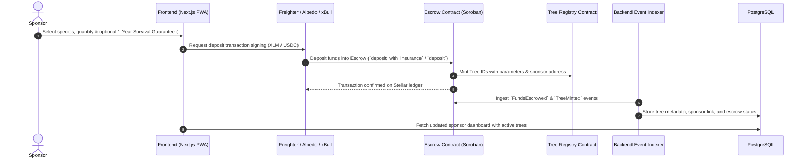
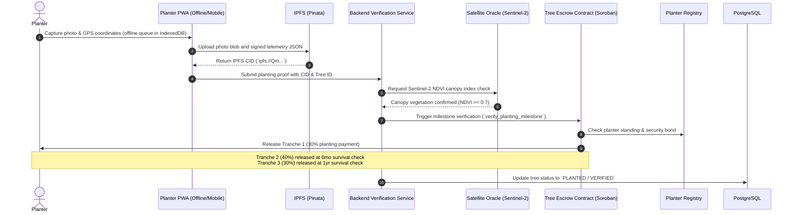
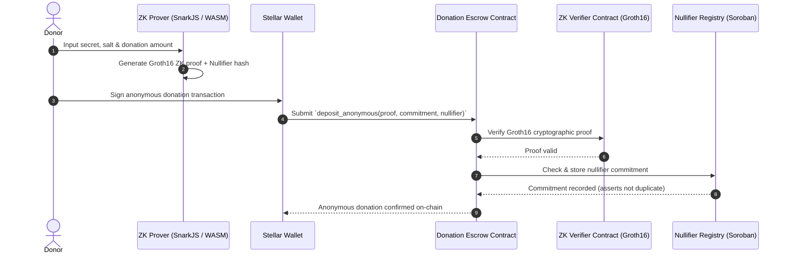

# 🏛️ Architecture Documentation — FarmCredit / Harvesta

> **High-Level System Architecture, C4 Architecture Models, Component Specifications, and Data Flows**  
> **Stellar Network (Soroban) • Next.js 15 PWA • Zero-Knowledge Cryptography • PostgreSQL • IPFS • AWS Cloud**  
> **Detailed C4 Specification:** [docs/C4_ARCHITECTURE.md](file:///docs/C4_ARCHITECTURE.md) • **System Architecture Guide:** [docs/ARCHITECTURE.md](file:///docs/ARCHITECTURE.md)

---

## 1. High-Level System Architecture (C4 Context & Container)

```mermaid
flowchart TB
    subgraph Clients["📱 Client Layer (Frontend / PWA)"]
        direction TB
        SP["🌱 Sponsor Web App<br/>(Donations, Carbon Dashboard, DEX)"]
        PL["📸 Planter Mobile PWA<br/>(Offline Camera, GPS Telemetry)"]
        INV["🛰️ Investor & Verifier Portal<br/>(Telemetry, Satellite NDVI Map)"]
        GOV["🗳️ DAO Governance Portal<br/>(Proposal & Species Voting)"]
        WAL["🔑 Stellar Wallets<br/>(Freighter / Albedo / xBull)"]
        ZKW["🔒 ZK WASM Prover<br/>(In-Browser Groth16 Proofs)"]
        
        SP --- WAL
        PL --- WAL
        INV --- WAL
        GOV --- WAL
        SP --- ZKW
        PL --- ZKW
    end

    subgraph Storage["📦 Decentralized Storage (IPFS)"]
        IPFS["🌐 IPFS Network (Pinata Pinning Cluster)<br/>• Planting Photos & Time-lapses<br/>• GPS Telemetry & Metadata JSON<br/>• Dynamic NFT Certificates & Seals"]
    end

    subgraph Backend["⚙️ Backend & Off-Chain Infrastructure"]
        API["🚀 API Server (Next.js 15 App Router / Node.js)<br/>• SEP-10 & JWT Authentication<br/>• Upload Coordinator & EXIF Validator<br/>• Anonymous ZK Relay & Metadata Sanitization"]
        INDEXER["📡 Stellar Event Indexer & Ingestion<br/>• Soroban RPC Listener<br/>• Horizon Event Streamer<br/>• Event Integrity Checker"]
        CALC["📊 Carbon Sequestration Engine<br/>• FAO/IPCC Biomass Growth Models<br/>• Scheduled Carbon Accrual Crons"]
        ORACLE["🛰️ Verification & Satellite Engine<br/>• Sentinel-2 Imagery Sync (NDVI Indices)<br/>• GPS Boundary & Geofence Validator<br/>• ZK-Proof Verification Service"]
        WORKERS["⚡ Background Workers & Daemons<br/>• Soroban TTL Renewal Bot<br/>• S3 Multi-Region Backup Replication"]
        DB[(🗄️ PostgreSQL Database (AWS RDS)<br/>• Off-chain Cache & Tree Index<br/>• User Profiles, Roles & Audit Trails)]
        REDIS[(⚡ Redis Cache (AWS ElastiCache)<br/>• Session Tokens & Rate Limits<br/>• BullMQ Task Queues)]
        
        API <--> DB
        API <--> REDIS
        INDEXER --> DB
        CALC <--> DB
        ORACLE <--> DB
        WORKERS <--> REDIS
        WORKERS --> DB
    end

    subgraph Blockchain["⚡ Stellar Network (Soroban Smart Contracts)"]
        direction TB
        RPC["🔗 Soroban RPC Node / Horizon"]
        
        subgraph Contracts["Smart Contracts Ecosystem (Rust / WASM)"]
            ESC["🔒 Escrow & Settlement<br/>(escrow, tree-escrow, escrow-milestone, donation-escrow, naira-payout)"]
            REG["🌳 Tree & Planter Registries<br/>(tree-registry, tree-token, tree-genetics, planter-registry, planting-bond)"]
            CARB["📉 Carbon Credits & DEX<br/>(carbon-credits, carbon-marketplace, carbon-dex, carbon-price-oracle)"]
            ZKC["🛡️ Privacy & Zero-Knowledge<br/>(zk-verifier, zk-location-verifier, nullifier-registry, aggregate-verifier)"]
            GOVC["🏛️ Governance & Security<br/>(platform-governance, species-voting, treasury, upgrade-timelock, admin-controls)"]
        end
        
        RPC <--> Contracts
    end

    %% Interactions
    PL -->|"1. Upload Proof (Photo + GPS)"| IPFS
    PL -->|"2. Submit Job Completion (IPFS CID)"| API
    SP -->|"3. Sponsor Tree / Anonymous ZK Deposit"| WAL
    WAL -->|"4. Sign & Submit Tx"| RPC
    
    API -->|"5. Pin Metadata / Verify CIDs"| IPFS
    API -->|"6. Trigger Verification Checks"| ORACLE
    
    INDEXER <-->|"7. Poll / Listen to Ledger Events"| RPC
    ORACLE -->|"8. Execute Verified Tranche Release"| RPC
    CALC -->|"9. Trigger On-Chain Carbon Minting"| RPC
    WORKERS -->|"10. Contract TTL Renewal Pings"| RPC
    
    Clients <-->|"11. Query Cached Data & Analytics"| API
```

---

## 2. End-to-End Data Flows

### Flow A: Tree Sponsorship, Escrow Lock & Optional Survival Guarantee


---

### Flow B: Planter Work Submission, Satellite Telemetry & Multi-Tranche Release


---

### Flow C: ZK Anonymous Donation & Double-Spend Nullifier Registry


---

## 3. Comprehensive Component Architecture

| Component Layer | Technologies Used | Key Responsibilities |
| :--- | :--- | :--- |
| **Frontend & Mobile PWA** | Next.js 15, React 19, TypeScript, Tailwind CSS v4, shadcn/ui, Workbox PWA | • **Responsive UI Architecture** (Sponsor portal, Planter mobile PWA, Carbon DEX, DAO governance)<br/>• **Offline Support** via Service Workers & IndexedDB for field workers in low-connectivity zones<br/>• **Multi-Wallet Integration** (Freighter, Albedo, xBull via SEP-10)<br/>• **Client-Side ZK Cryptography** (SnarkJS WASM Prover for private donations & geofencing) |
| **Smart Contracts (Soroban)** | Rust, Soroban SDK v21+, WebAssembly (WASM) | • **`escrow` / `tree-escrow` / `escrow-milestone`**: Multi-tranche payments, 1-yr survival guarantee (#1021), platform fees (#467)<br/>• **`tree-registry` / `tree-token` / `tree-genetics`**: On-chain tree NFT identity, geohashes, biodiversity lineage<br/>• **`carbon-credits` / `carbon-marketplace` / `carbon-dex`**: VCU credit minting, order book, AMM liquidity pools<br/>• **`zk-verifier` / `nullifier-registry` / `zk-location-verifier`**: Groth16 SNARK verification & double-spend protection<br/>• **`planter-registry` / `planting-bond` / `planter-blacklist`**: Planter KYC, performance tiers, bond staking & slashing<br/>• **`platform-governance` / `species-voting` / `upgrade-timelock`**: DAO voting, species whitelisting, governed upgrades |
| **Backend & Compute** | Next.js App Router, Node.js, PostgreSQL (AWS RDS), Redis (ElastiCache) | • **Stellar Event Indexer**: Replay-safe ingestion of Soroban events into relational database<br/>• **Carbon Sequestration Engine**: Biomass growth models (FAO/IPCC Tier 1) and scheduled accrual crons<br/>• **Satellite & Location Oracle**: Sentinel-2 multi-spectral NDVI canopy validation and EXIF parsing<br/>• **Security & Rate Limiting**: 2FA lockout initialization, token bucket rate limits, CORS policies |
| **Decentralized Storage (IPFS)** | IPFS Network, Pinata Pinning Cluster | • Content-addressed storage for planting photos, time-lapses, EXIF telemetry, and audit certificates<br/>• Dynamic SVG metadata and cryptographic proof attachments |
| **Cloud & Edge Infrastructure** | AWS CloudFront, AWS WAF, RDS Multi-AZ, S3 Multi-Region, Sentry, ELK | • Edge DDoS protection, rate limiting, and bot defense<br/>• Automated cross-region S3 backup replication and disaster recovery (RPO < 5 min, RTO < 15 min)<br/>• Centralized ELK log aggregation and Sentry APM error monitoring |

---

## 4. References & Documentation Links

- **Full C4 Model Specification:** [docs/C4_ARCHITECTURE.md](file:///docs/C4_ARCHITECTURE.md)
- **Detailed System Architecture Guide:** [docs/ARCHITECTURE.md](file:///docs/ARCHITECTURE.md)
- **Smart Contracts Reference:** [CONTRACTS.md](file:///CONTRACTS.md)
- **API & OpenAPI Specification:** [docs/openapi.yaml](file:///docs/openapi.yaml)
- **Zero-Knowledge Circuits & Privacy Guide:** [ZK_CIRCUITS_DOCUMENTATION.md](file:///ZK_CIRCUITS_DOCUMENTATION.md)
- **AWS Disaster Recovery & Backup Plan:** [docs/DISASTER_RECOVERY.md](file:///docs/DISASTER_RECOVERY.md)
