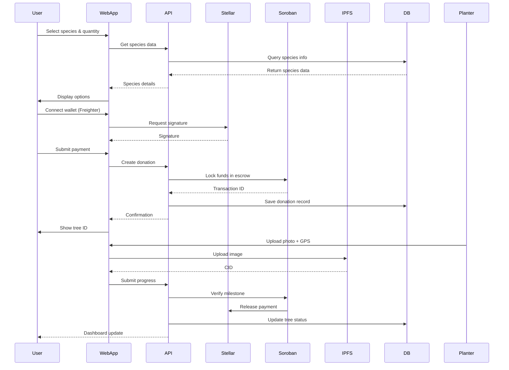
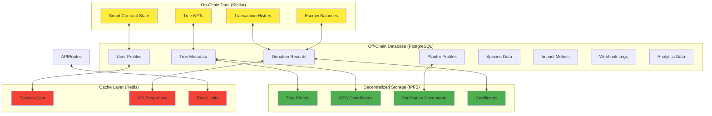
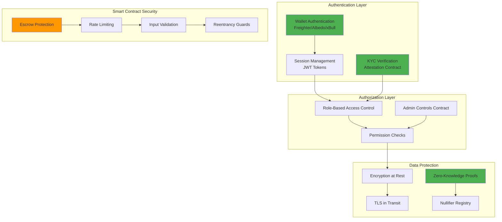

# Harvesta Architecture Diagram

## High-Level System Architecture

```mermaid
graph TB
    subgraph "Client Layer"
        WebApp[Web Application<br/>Next.js + React]
        MobileApp[Mobile App<br/>React Native<br/>(Planned)]
    end

    subgraph "Frontend Layer"
        Components[React Components]
        Hooks[Custom Hooks]
        Contexts[React Context]
        Utils[Utility Functions]
    end

    subgraph "API Layer"
        APIRoutes[API Routes<br/>Next.js App Router]
        Webhooks[Webhook Handlers]
        Auth[Authentication]
    end

    subgraph "Business Logic Layer"
        Services[Business Services]
        StellarSDK[Stellar SDK]
        IPFSClient[IPFS Client]
        EmailService[Email Service]
        Analytics[Analytics Service]
    end

    subgraph "Data Layer"
        PostgreSQL[(PostgreSQL<br/>Database)]
        Redis[(Redis<br/>Cache)]
        IPFS[(IPFS<br/>Decentralized Storage)]
    end

    subgraph "Blockchain Layer"
        Stellar[Stellar Network]
        Soroban[Soroban Smart Contracts]
    end

    subgraph "Smart Contracts"
        TreeEscrow[Tree Escrow]
        FarmerRegistry[Farmer Registry]
        SpeciesRegistry[Species Registry]
        DonationEscrow[Donation Escrow]
        EscrowMilestone[Escrow Milestone]
        AdminControls[Admin Controls]
        KYCAttestation[KYC Attestation]
        LocationProof[Location Proof]
        NullifierRegistry[Nullifier Registry]
        ZKVerifier[ZK Verifier]
        ZKLocationVerifier[ZK Location Verifier]
        AggregateImpactVerifier[Aggregate Impact Verifier]
        NairaPayout[Naira Payout]
        TreeToken[Tree Token]
        SpeciesVoting[Species Voting]
    end

    subgraph "External Services"
        Stripe[Stripe<br/>Payment Processing]
        Freighter[Freighter<br/>Wallet]
        Albedo[Albedo<br/>Wallet]
        XBull[xBull<br/>Wallet]
        EmailProvider[Email Provider<br/>SendGrid/SES]
    end

    subgraph "Monitoring & Observability"
        Logs[Logging]
        Metrics[Metrics Collection]
        Alerts[Alerting]
    end

    %% Data Flows
    WebApp --> Components
    Components --> Hooks
    Components --> Contexts
    Components --> APIRoutes
    
    APIRoutes --> Services
    APIRoutes --> Auth
    Webhooks --> Services
    
    Services --> StellarSDK
    Services --> IPFSClient
    Services --> EmailService
    Services --> Analytics
    
    Services --> PostgreSQL
    Services --> Redis
    IPFSClient --> IPFS
    
    StellarSDK --> Stellar
    Stellar --> Soroban
    Soroban --> TreeEscrow
    Soroban --> FarmerRegistry
    Soroban --> SpeciesRegistry
    Soroban --> DonationEscrow
    Soroban --> EscrowMilestone
    Soroban --> AdminControls
    Soroban --> KYCAttestation
    Soroban --> LocationProof
    Soroban --> NullifierRegistry
    Soroban --> ZKVerifier
    Soroban --> ZKLocationVerifier
    Soroban --> AggregateImpactVerifier
    Soroban --> NairaPayout
    Soroban --> TreeToken
    Soroban --> SpeciesVoting
    
    Services --> Stripe
    WebApp --> Freighter
    WebApp --> Albedo
    WebApp --> XBull
    EmailService --> EmailProvider
    
    Services --> Logs
    Services --> Metrics
    Metrics --> Alerts

    style WebApp fill:#e1f5ff
    style MobileApp fill:#e1f5ff
    style Stellar fill:#ffeb3b
    style Soroban fill:#ff9800
    style IPFS fill:#4caf50
    style PostgreSQL fill:#2196f3
    style Redis fill:#f44336
```

## Component Interactions

### User Flow: Sponsor a Tree



### Smart Contract Data Flow


## Data Storage Architecture



## Security Architecture



## Deployment Architecture

```mermaid
graph TB
    subgraph "Production Environment"
        subgraph "Frontend"
            Vercel[Vercel<br/>Next.js Hosting]
            CDN[CDN<br/>Static Assets]
        end
        
        subgraph "Backend"
            API[API Server<br/>Node.js]
            Workers[Background Workers<br/>Indexer/Webhooks]
        end
        
        subgraph "Database"
            RDS[PostgreSQL<br/>AWS RDS]
            ElastiCache[Redis<br/>AWS ElastiCache]
        end
        
        subgraph "Storage"
            Pinata[Pinata<br/>IPFS Pinning]
            S3[AWS S3<br/>Backup Storage]
        end
        
        subgraph "Monitoring"
            CloudWatch[AWS CloudWatch]
            Sentry[Sentry<br/>Error Tracking]
        end
    end

    Vercel --> CDN
    Vercel --> API
    API --> RDS
    API --> ElastiCache
    API --> Pinata
    Workers --> RDS
    Workers --> Pinata
    API --> CloudWatch
    Workers --> CloudWatch
    Vercel --> Sentry
    API --> Sentry
    Pinata --> S3

    style Vercel fill:#000000
    style Vercel stroke:#ffffff
    style Vercel color:#ffffff
```



## Technology Stack Summary

| Layer | Technology | Purpose |
|-------|-----------|---------|
| **Frontend** | Next.js 14, React, TypeScript | Web application framework |
| **Styling** | Tailwind CSS, shadcn/ui | UI components and styling |
| **State Management** | React Context, Zustand | Client-side state |
| **Smart Contracts** | Soroban (Rust), Stellar | Blockchain logic |
| **Wallet Integration** | Freighter, Albedo, xBull | Stellar wallet connections |
| **Backend API** | Next.js API Routes | Server-side endpoints |
| **Database** | PostgreSQL | Relational data storage |
| **Cache** | Redis | Performance caching |
| **Decentralized Storage** | IPFS (Pinata) | Photo and document storage |
| **Payment Processing** | Stripe | Fiat payment gateway |
| **Email** | SendGrid/SES | Transactional emails |
| **Monitoring** | Sentry, CloudWatch | Error tracking and metrics |
| **CI/CD** | GitHub Actions | Automated testing and deployment |

## Key Design Patterns

1. **Escrow Pattern**: Funds held in smart contracts until verification
2. **NFT Pattern**: Unique tree IDs as non-fungible tokens
3. **Zero-Knowledge Proofs**: Privacy-preserving verification
4. **Webhook Pattern**: Event-driven notifications
5. **Repository Pattern**: Data access abstraction
6. **Service Layer Pattern**: Business logic separation
7. **Component Pattern**: Atomic design for UI components

## Data Flow Summary

1. **User initiates donation** → Frontend validates → Smart contract escrows funds
2. **Planter accepts job** → Smart contract records assignment → Database updates
3. **Planter uploads proof** → IPFS stores data → Smart contract verifies → Payment released
4. **Dashboard updates** → Webhook triggers → Database sync → Frontend refresh
5. **Carbon calculation** → Species data lookup → CO₂ estimation → Impact metrics stored
