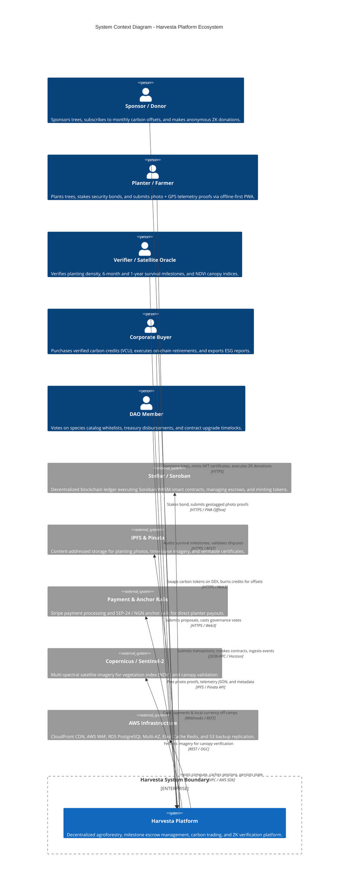
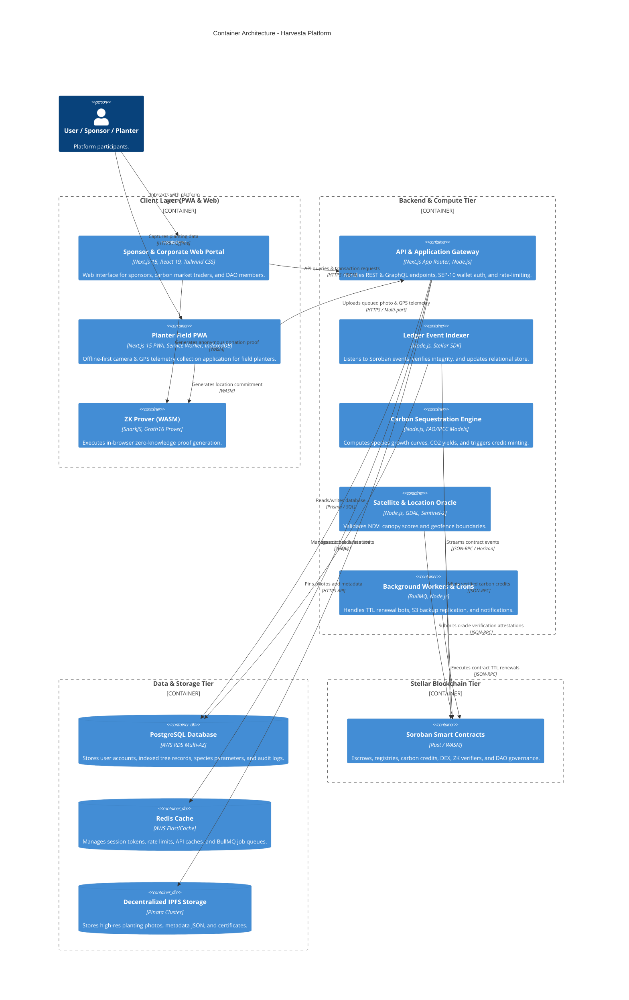
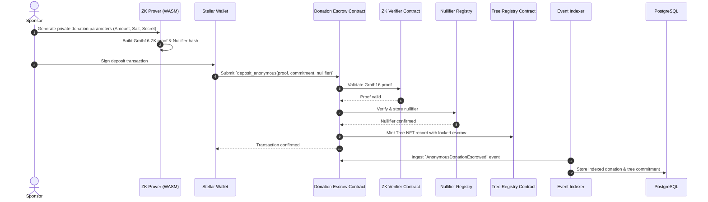
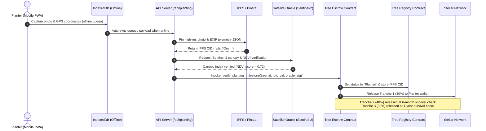
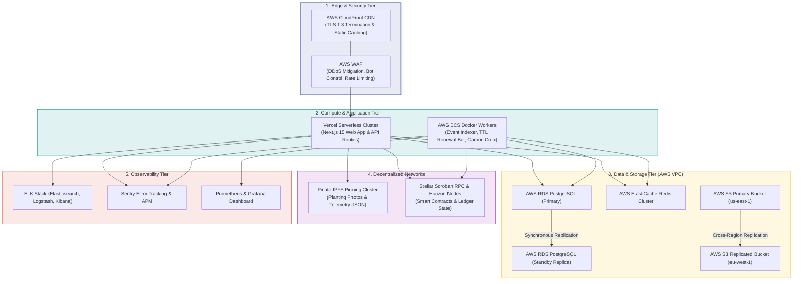

# 🏛️ Harvesta / FarmCredit — System Architecture & C4 Model Guide

> **High-Level System Architecture, Component Specifications, and Data Flows**  
> **Stellar Network (Soroban) • Next.js 15 PWA • Zero-Knowledge Cryptography • AWS Multi-Region & IPFS**  
> **See also:** Full C4 Architecture Model specification in [docs/C4_ARCHITECTURE.md](file:///docs/C4_ARCHITECTURE.md).

---

## 1. High-Level System Context (C4 Level 1)

---

## 2. Container Architecture (C4 Level 2)

---

## 3. Smart Contracts Ecosystem (C4 Level 3)

The smart contract layer contains 26+ modular Soroban contracts categorized into 6 domains:

```mermaid
graph TB
    subgraph "1. Escrow & Settlement"
        ESC["escrow<br/>(Single-Tree & 1-Yr Survival Guarantee #1021)"]
        TESC["tree-escrow<br/>(3-Tranche Milestone Payouts & Min Density #514)"]
        MESC["escrow-milestone<br/>(Single-Milestone Remainder Release)"]
        DESC["donation-escrow<br/>(Campaigns, Multi-Currency & Subscriptions)"]
        NPAY["naira-payout<br/>(Direct NGN Fiat Off-Ramp Settlement)"]
    end

    subgraph "2. Registry & Core Assets"
        TREG["tree-registry<br/>(Tree NFT IDs, Species, Geohash, Status)"]
        TTOK["tree-token<br/>(Tokenized Fractional Tree Ownership)"]
        TGEN["tree-genetics<br/>(Seed Provenance & Biodiversity Lineage)"]
        TRET["tree-retirement<br/>(Mortality Logging & Carbon Burning)"]
        PREG["planter-registry / farmer-registry<br/>(Planter Profiles, Staking, KYC)"]
        PBLK["planter-blacklist<br/>(Fraud Prevention & Quarantine)"]
        PBOND["planting-bond<br/>(Security Bond Staking & Slashing)"]
    end

    subgraph "3. Carbon Credits & Marketplace"
        CC["carbon-credits<br/>(Verified Carbon Units Minting & Burning)"]
        CMKT["carbon-marketplace<br/>(P2P Order Book Trading)"]
        CDEX["carbon-dex<br/>(AMM Carbon/USDC Liquidity Pools)"]
        CORA["carbon-price-oracle<br/>(Spot Carbon Pricing Feeds)"]
    end

    subgraph "4. Zero-Knowledge & Verification"
        ZKV["zk-verifier<br/>(Groth16 SNARK Proof Verifier)"]
        ZKL["zk-location-verifier<br/>(Private Northern Nigeria Boundary Check)"]
        NREG["nullifier-registry<br/>(SHA-256 Double-Claim Protection)"]
        AGGV["aggregate-impact-verifier<br/>(Multi-Tree Batch Proofs)"]
        NFTC["nft-certificate / sponsor-receipt<br/>(Dynamic SVG NFT Certificates)"]
        KYC["kyc-attestation<br/>(On-Chain KYC/AML Validation)"]
    end

    subgraph "5. Governance & Operations"
        GOV["platform-governance<br/>(DAO Proposal & Voting Engine)"]
        SPEC["species-voting / species-catalog<br/>(Species Whitelist & Growth Curves)"]
        TREAS["treasury<br/>(Multisig Protocol Reserves)"]
        STAK["staking-rewards / verifier-staking<br/>(Incentive Distribution)"]
        UPL["upgrade-timelock / transparent-proxy<br/>(Governed Contract Upgrades)"]
        ADM["admin-controls / auth-contract<br/>(Role-Based Access & Circuit Breaker)"]
        SEAL["public-seal<br/>(Notary Audit Timestamp Seals)"]
    end

    ESC --> TREG
    TESC --> PREG
    TESC --> PBOND
    DESC --> ZKV
    DESC --> NREG
    ZKL --> NREG
    CC --> TREG
    CMKT --> CC
    CDEX --> CC
    CMKT --> CORA
    NFTC --> TREG
    GOV --> TREAS
    SPEC --> TREG
    UPL --> ADM

    style ESC fill:#e1f5fe,stroke:#0288d1
    style TESC fill:#e1f5fe,stroke:#0288d1
    style TREG fill:#e8f5e9,stroke:#388e3c
    style CC fill:#fff3e0,stroke:#f57c00
    style ZKV fill:#f3e5f5,stroke:#7b1fa2
    style GOV fill:#fbe9e7,stroke:#d84315
```

---

## 4. End-to-End Data Flows (C4 Level 4)

### 4.1 Anonymous Tree Sponsorship & Escrow Lock

### 4.2 Planter Proof Submission, Satellite Telemetry & Milestone Disbursement

---

## 5. Deployment & Cloud Infrastructure (C4 Deployment Topology)

---

## 6. Technology Stack & Key References

| Layer | Technology | Purpose |
|---|---|---|
| **Frontend** | Next.js 15, React 19, Tailwind CSS v4, shadcn/ui | Modern, responsive web and mobile PWA interface |
| **PWA & Offline** | Service Worker, Workbox, IndexedDB | Offline capture & auto-sync for rural planters |
| **Smart Contracts** | Rust, Soroban SDK v21+, WASM | 26+ modular smart contracts on Stellar |
| **Cryptography** | SnarkJS, Groth16, Circom, SHA-256 | Zero-knowledge privacy proofs and nullifiers |
| **Database & Cache** | PostgreSQL 16 (AWS RDS), Redis 7 (ElastiCache) | Off-chain relational cache, sessions, and queues |
| **Decentralized Storage**| IPFS, Pinata Gateway | Content-addressed storage for photos and telemetry |
| **Observability** | Sentry APM, ELK Stack, Prometheus & Grafana | Real-time error tracking, logging, and metrics |
| **Infrastructure** | AWS CloudFront, WAF, S3 Multi-Region, Terraform | Cloud hosting, security, and disaster recovery |

For the complete technical specifications and C4 model diagrams, please refer to [docs/C4_ARCHITECTURE.md](file:///docs/C4_ARCHITECTURE.md).
