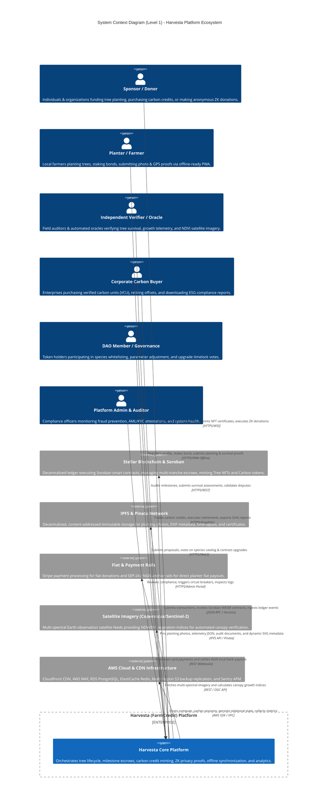
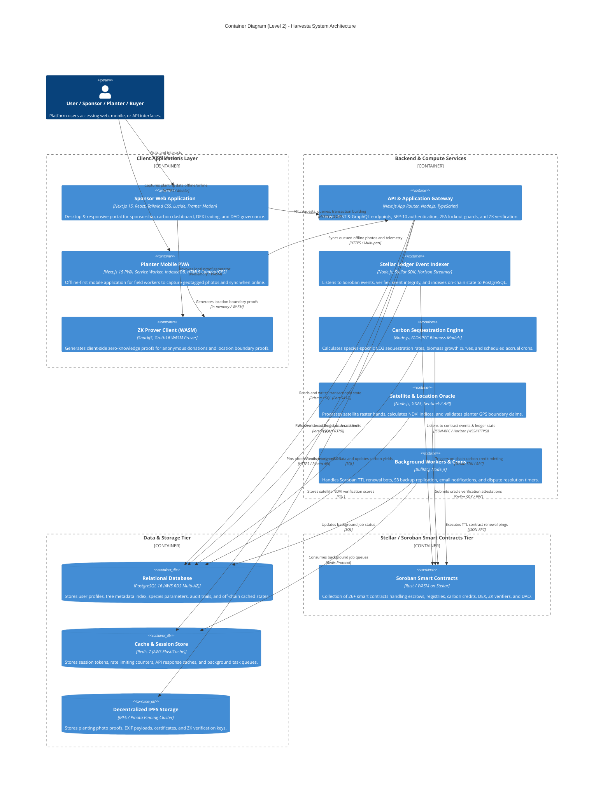
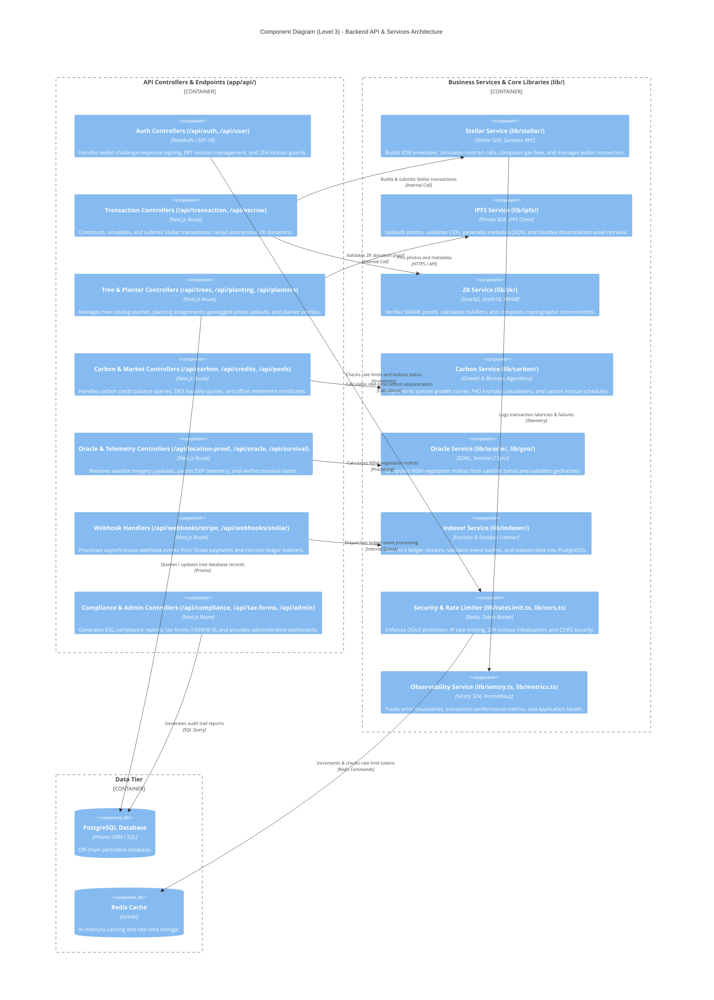
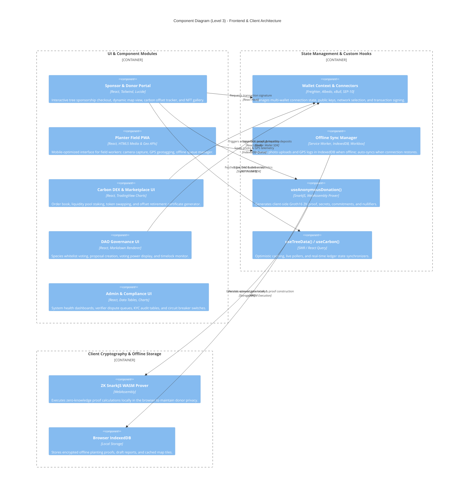
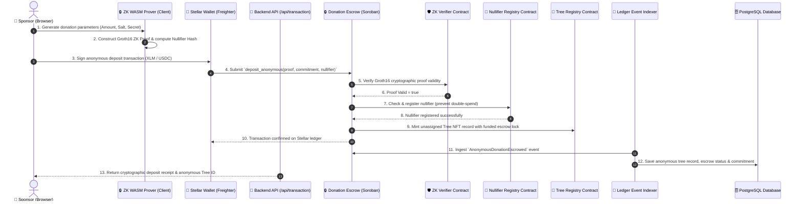
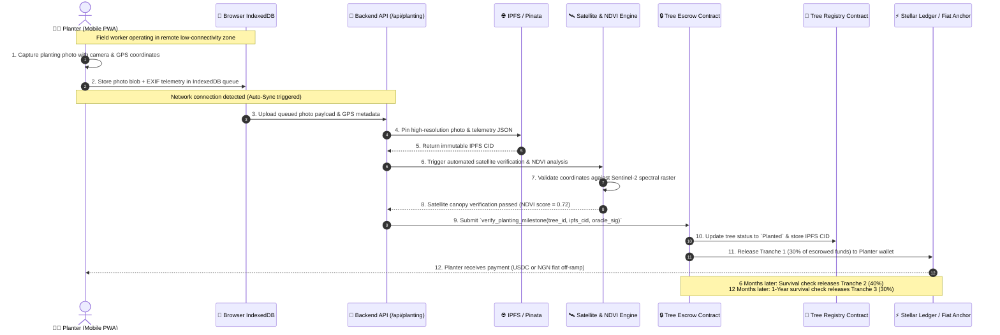
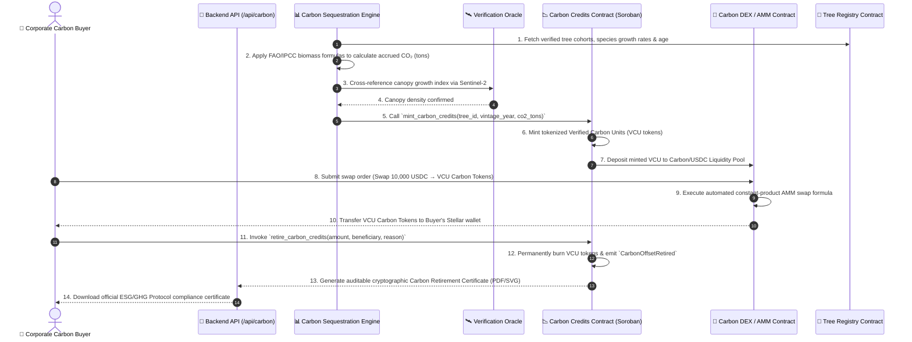

# 🏛️ Harvesta / FarmCredit — C4 Architecture Documentation

> **Comprehensive C4 Model Architecture Specification**  
> **System Context (L1) • Container Architecture (L2) • Component Specifications (L3) • Dynamic & Deployment Topologies (L4)**  
> **Stellar Network (Soroban) • Next.js 15 PWA • Zero-Knowledge Cryptography • AWS & IPFS Infrastructure**

---

## Executive Summary

Harvesta (FarmCredit) is an enterprise-grade, decentralized reforestation, agroforestry financing, and verifiable carbon credit platform built on the **Stellar Network (Soroban Smart Contracts)**. The platform connects tree sponsors, field planters, independent verifiers, and corporate carbon buyers through cryptographically verified workflows:
- **Time-locked, milestone-based smart escrows** with survival guarantees and platform fee distribution.
- **Zero-Knowledge (ZK) privacy-preserving donations** and private geofenced location proofs using Groth16 SNARKs.
- **Offline-first Progressive Web App (PWA)** for rural planters with EXIF telemetry, GPS verification, and satellite oracle cross-referencing.
- **On-chain Carbon Credits (VCU)**, automated market maker (Carbon DEX), dynamic NFT certificates, and DAO governance.

---

## 1. C4 Level 1: System Context Diagram

The System Context diagram illustrates the high-level boundary of the Harvesta platform, the primary human actors interacting with the system, and external third-party services and networks.



---

## 2. C4 Level 2: Container Diagram

The Container diagram details the high-level software containers, frontends, APIs, data stores, background workers, and blockchain smart contracts making up the Harvesta system.



---

## 3. C4 Level 3: Component Diagrams

### 3.1 Smart Contracts Architecture Component Diagram

Harvesta's on-chain architecture comprises modular Soroban smart contracts written in Rust, categorized into 6 functional domains:

```mermaid
C4Component
    title Component Diagram (Level 3) - Soroban Smart Contracts Ecosystem

    Container_Boundary(escrowDomain, "Escrow & Financial Settlement") {
        Component(escrowCore, "escrow", "Rust / Soroban", "Single-tree escrow with 1-Year Survival Insurance Guarantee (#1021) and platform fees (#467).")
        Component(treeEscrow, "tree-escrow", "Rust / Soroban", "Multi-tranche milestone escrow (30% planting, 40% 6mo, 30% 1yr) with minimum planting density validation (#514).")
        Component(escrowMilestone, "escrow-milestone", "Rust / Soroban", "Single-milestone escrow with remainder release triggered by authorized verifiers.")
        Component(donationEscrow, "donation-escrow", "Rust / Soroban", "Multi-currency campaign escrow supporting XLM, USDC, EURC, and recurring subscription pools.")
        Component(nairaPayout, "naira-payout", "Rust / Soroban", "Settles local currency disbursements to Nigerian farmers via regulated off-ramp anchors.")
        Component(subSponsorship, "subscription-sponsorship", "Rust / Soroban", "Automates recurring monthly planting sponsorships and continuous carbon offset funding.")
    }

    Container_Boundary(registryDomain, "Tree & Planter Registries") {
        Component(treeRegistry, "tree-registry", "Rust / Soroban", "Registers unique tree IDs, species attributes, geohashes, and lifecycle states (Planted, Verified, Dead).")
        Component(treeToken, "tree-token", "Rust / Soroban", "Tokenized fractional tree ownership and semi-fungible impact representations.")
        Component(treeGenetics, "tree-genetics", "Rust / Soroban", "Tracks seed source provenance, genetic variety, and biodiversity resilience metrics.")
        Component(treeRetirement, "tree-retirement", "Rust / Soroban", "Handles permanent tree mortality, offset retirement, and token burns.")
        Component(planterRegistry, "planter-registry / farmer-registry", "Rust / Soroban", "Maintains planter identities, performance tiers, KYC status, and completed job histories.")
        Component(planterBlacklist, "planter-blacklist", "Rust / Soroban", "Anti-fraud registry preventing bad actors from accepting jobs or withdrawing bonds.")
        Component(plantingBond, "planting-bond", "Rust / Soroban", "Manages security bond deposits staked by planters, with slashing rules for fraud.")
    }

    Container_Boundary(carbonDomain, "Carbon Credits & Marketplace") {
        Component(carbonCredits, "carbon-credits", "Rust / Soroban", "Mints Verified Carbon Units (VCU), manages vintages, serial numbers, and irreversible offset retirement.")
        Component(carbonMarketplace, "carbon-marketplace", "Rust / Soroban", "Peer-to-peer order book marketplace for listing, buying, and selling carbon credits.")
        Component(carbonDex, "carbon-dex", "Rust / Soroban", "Automated Market Maker (AMM) liquidity pools enabling instant swaps between Carbon Tokens, XLM, and USDC.")
        Component(carbonOracle, "carbon-price-oracle", "Rust / Soroban", "Decentralized oracle feed supplying global spot carbon prices and currency conversion rates.")
    }

    Container_Boundary(privacyDomain, "Zero-Knowledge & Verification") {
        Component(zkVerifier, "zk-verifier / groth16", "Rust / Soroban", "On-chain Groth16 zk-SNARK verifier validating anonymous donation proofs.")
        Component(zkLocationVerifier, "zk-location-verifier / location-proof", "Rust / Soroban", "Proves planter GPS coordinates are inside approved regional polygons without leaking exact coords.")
        Component(nullifierRegistry, "nullifier-registry", "Rust / Soroban", "Maintains spent nullifiers (SHA-256 commitments) to prevent double-spending and replay attacks.")
        Component(aggregateVerifier, "aggregate-impact-verifier", "Rust / Soroban", "Aggregates and verifies batched multi-tree impact claims in a single cryptographic proof.")
        Component(nftCertificate, "nft-certificate / sponsor-receipt", "Rust / Soroban", "Generates on-chain verifiable SVG NFT certificates and donation receipts for sponsors.")
        Component(kycAttestation, "kyc-attestation", "Rust / Soroban", "Verifies on-chain KYC/AML accreditation for institutional sponsors and authorized verifiers.")
    }

    Container_Boundary(govDomain, "Governance & Protocol Security") {
        Component(platformGov, "platform-governance", "Rust / Soroban", "DAO voting engine for protocol parameter updates, fee structures, and proposal lifecycle.")
        Component(speciesVoting, "species-voting / species-catalog", "Rust / Soroban", "Community-governed whitelist of indigenous tree species and ecological biomass growth formulas.")
        Component(treasury, "treasury", "Rust / Soroban", "Multi-signature protocol treasury managing platform reserve funds and ecosystem grants.")
        Component(stakingRewards, "staking-rewards / verifier-staking", "Rust / Soroban", "Incentive distribution engine rewarding verifiers, liquidity providers, and active planters.")
        Component(upgradeTimelock, "upgrade-timelock / transparent-proxy", "Rust / Soroban", "Time-delayed proxy architecture for transparent, governed smart contract upgrades.")
        Component(adminControls, "admin-controls / auth-contract", "Rust / Soroban", "Role-Based Access Control (RBAC), emergency circuit breakers, and administrative multisig.")
        Component(publicSeal, "public-seal", "Rust / Soroban", "Cryptographic notary seals attesting to external audit timestamps and compliance data.")
    }

    Rel(escrowCore, treeRegistry, "Mints tree record on deposit", "Soroban Cross-Contract Call")
    Rel(escrowCore, adminControls, "Validates emergency pause status", "Auth Check")
    Rel(treeEscrow, planterRegistry, "Checks planter standing & bond status", "Contract Call")
    Rel(treeEscrow, plantingBond, "Enforces bond lock / slashing", "Contract Call")
    Rel(escrowMilestone, treeRegistry, "Updates tree milestone status", "Contract Call")

    Rel(donationEscrow, zkVerifier, "Verifies ZK proof for private donation", "WASM Call")
    Rel(donationEscrow, nullifierRegistry, "Registers spent nullifiers", "Contract Call")
    Rel(zkLocationVerifier, nullifierRegistry, "Records location proof commitment", "Contract Call")

    Rel(carbonCredits, treeRegistry, "Queries tree age & species CO2 quota", "Contract Call")
    Rel(carbonMarketplace, carbonCredits, "Escrows & transfers carbon tokens", "Token Transfer")
    Rel(carbonDex, carbonCredits, "Manages carbon/USDC liquidity pool", "AMM Swap")
    Rel(carbonMarketplace, carbonOracle, "Fetches floor price validation", "Oracle Read")

    Rel(nftCertificate, treeRegistry, "Pulls metadata for dynamic SVG generation", "Metadata Read")
    Rel(platformGov, treasury, "Executes approved funding allocations", "Multisig Call")
    Rel(speciesVoting, treeRegistry, "Whitelists eligible planting species", "Registry Update")
    Rel(upgradeTimelock, transparentProxy, "Dispatches upgrade WASM hash after timelock", "Contract Upgrade")
```

---

### 3.2 Backend API & Service Layer Component Diagram

The Next.js API and backend services layer manages off-chain business logic, authentication, external integrations, background workers, and telemetry processing.



---

### 3.3 Frontend & Client Architecture Component Diagram

The client presentation layer is built as a progressive, offline-ready web application using Next.js 15, React, and client-side zero-knowledge cryptography.



---

## 4. C4 Level 4: Dynamic Interaction & Data Flow Diagrams

### 4.1 Flow 1: Privacy-Preserving Anonymous Tree Sponsorship & Escrow



---

### 4.2 Flow 2: Planter Proof-of-Planting, Satellite Telemetry & Multi-Tranche Payout



---

### 4.3 Flow 3: Carbon Sequestration Accrual, Verification, and Secondary DEX Trading



---

## 5. C4 Deployment & Infrastructure Architecture Diagram

The Deployment diagram illustrates the physical and containerized infrastructure topology across AWS Cloud, Vercel edge networks, decentralized networks, and observability services.

```mermaid
C4Deployment
    title Deployment & Infrastructure Diagram - Production Environment

    Deployment_Node(edgeTier, "Edge & Security Tier", "Global Anycast Edge") {
        Deployment_Node(awsCloudFront, "AWS CloudFront & WAF", "CDN & Web Application Firewall") {
            Container(cdnEdge, "CloudFront CDN Edge", "Edge Caching & SSL Termination", "Accelerates static asset delivery, enforces TLS 1.3, and mitigates DDoS attacks.")
            Container(wafRules, "AWS WAF Rules", "Rate Limiting & Bot Control", "Inspects HTTP headers, blocks malicious payloads, and limits abusive IP traffic.")
        }
    }

    Deployment_Node(computeTier, "Application & Compute Tier", "Vercel & AWS ECS Cluster") {
        Deployment_Node(vercelPlatform, "Vercel Serverless Platform", "Next.js 15 Node.js Runtime") {
            Container(frontendContainers, "Next.js Web & API Nodes", "Node.js Serverless", "Renders React server components, handles API routes, and proxies wallet requests.")
        }
        Deployment_Node(workerCluster, "AWS ECS / Docker Workers", "Linux Containers") {
            Container(workerProcess, "Worker & Indexer Daemon", "Dockerfile.workers", "Runs Soroban ledger indexers, carbon calculation crons, and TTL renewal bots.")
        }
    }

    Deployment_Node(dataTier, "Database & Storage Tier", "AWS VPC Private Subnet") {
        Deployment_Node(rdsCluster, "AWS RDS PostgreSQL", "Multi-AZ Database Cluster") {
            ContainerDb(primaryDb, "Primary PostgreSQL Node", "PostgreSQL 16", "Active read/write transactional relational database.")
            ContainerDb(standbyDb, "Standby Replica", "PostgreSQL 16", "Synchronous warm standby replica with automated failover.")
        }
        Deployment_Node(elasticacheCluster, "AWS ElastiCache Redis", "Multi-AZ Redis Cluster") {
            ContainerDb(redisPrimary, "Redis Master & Replica", "Redis 7 Cluster", "In-memory cache, session tokens, rate limiting counters, and BullMQ queues.")
        }
        Deployment_Node(s3Storage, "AWS S3 Multi-Region Backup", "s3-backup-replication.tf") {
            ContainerDb(s3Primary, "Primary S3 Bucket (us-east-1)", "Object Storage", "Stores system backups, audit exports, and generated PDF/SVG certificates.")
            ContainerDb(s3Secondary, "Replicated S3 Bucket (eu-west-1)", "Object Storage", "Automated cross-region disaster recovery replica.")
        }
    }

    Deployment_Node(decentralizedTier, "Decentralized Networks Tier", "Global P2P Networks") {
        Deployment_Node(pinataCluster, "IPFS Pinning Cluster", "Pinata Gateway") {
            ContainerDb(ipfsNodes, "IPFS Storage Nodes", "IPFS Protocol", "Immutable storage for tree photos, EXIF payloads, and verification documents.")
        }
        Deployment_Node(stellarCluster, "Stellar Network", "Mainnet / Testnet") {
            Container(sorobanNodes, "Soroban RPC & Horizon Nodes", "Stellar Core & RPC", "Processes smart contract calls, maintains distributed ledger, and emits events.")
        }
    }

    Deployment_Node(observabilityTier, "Observability & Monitoring Tier", "AWS & Cloud SaaS") {
        Deployment_Node(elkStack, "ELK Logging Stack", "docker-compose.elk.yml") {
            Container(elasticSearch, "Elasticsearch & Logstash", "Search & Ingestion", "Aggregates application, access, and security logs in real-time.")
            Container(kibana, "Kibana Dashboard", "Visualizer", "Log visualization, query analytics, and anomaly alerting.")
        }
        Deployment_Node(prometheusStack, "Metrics & APM", "docker-compose.monitoring.yml & Sentry") {
            Container(sentryApm, "Sentry Error Tracking", "Cloud APM", "Real-time error tracking, exception alerting, and distributed performance tracing.")
            Container(grafanaMon, "Prometheus & Grafana", "Time-Series Metrics", "Monitors server CPU, memory, transaction throughput, and Soroban gas consumption.")
        }
    }

    Rel(cdnEdge, frontendContainers, "Routes valid web & API traffic", "HTTPS / Keep-Alive")
    Rel(frontendContainers, primaryDb, "Queries and persists data", "PostgreSQL Wire Protocol / TLS")
    Rel(frontendContainers, redisPrimary, "Caches responses & checks rate limits", "Redis Protocol / TLS")
    Rel(frontendContainers, ipfsNodes, "Uploads and pins photos", "HTTPS / REST")
    Rel(frontendContainers, sorobanNodes, "Simulates & submits Soroban transactions", "JSON-RPC (HTTPS)")

    Rel(workerProcess, primaryDb, "Updates indexed events & carbon records", "SQL")
    Rel(workerProcess, redisPrimary, "Pulls queued jobs", "Redis Protocol")
    Rel(workerProcess, sorobanNodes, "Listens to ledger streams & renews contract TTLs", "WSS / JSON-RPC")

    Rel(primaryDb, standbyDb, "Synchronous Multi-AZ streaming replication", "Internal VPC")
    Rel(s3Primary, s3Secondary, "Automated asynchronous cross-region replication", "AWS Backbone")

    Rel(frontendContainers, elkStack, "Streams JSON application logs", "WSS / Logstash")
    Rel(frontendContainers, sentryApm, "Captures unhandled exceptions & APM traces", "HTTPS")
    Rel(workerProcess, sentryApm, "Captures worker job failures", "HTTPS")
```

---

## 6. Technical Specifications & Architecture Decisions

### 6.1 Key Architectural Patterns

| Pattern | Implementation | Justification |
|---|---|---|
| **Multi-Tranche Escrow** | `tree-escrow`, `escrow` | Funds released in 3 tranches (30% planting, 40% 6mo, 30% 1yr) ensuring planter long-term care and survival alignment. |
| **Survival Insurance Guarantee** | `escrow` (#1021) | Optional 2% fee providing sponsors 100% full refund if tree dies within 1 year. |
| **Zero-Knowledge Privacy** | Groth16 SnarkJS, `zk-verifier`, `nullifier-registry` | Enables donors to prove funding validity and planters to prove regional boundaries without revealing identity or exact coordinates. |
| **Offline-First PWA** | Next.js PWA, Service Workers, IndexedDB | Allows field planters in rural Nigerian regions without internet access to capture geotagged proofs and auto-sync when connected. |
| **Decentralized Storage & Notary** | IPFS (Pinata), `public-seal` | Ensures immutable proof photos, EXIF metadata, and audit reports cannot be retroactively altered. |
| **Automated Carbon Sequestration** | `carbon-credits`, `carbon-dex`, FAO biomass models | Accrues verifiable carbon units (VCU) based on verified tree growth curves and provides liquid on-chain trading. |
| **Timelocked Contract Upgradability** | `upgrade-timelock`, `transparent-proxy` | Ensures protocol smart contract upgrades require multi-day timelocks and DAO governance approval. |

### 6.2 Security & Compliance Matrix

| Security Layer | Mechanism | Protection |
|---|---|---|
| **Edge Security** | AWS WAF, CloudFront | Rate limiting, bot filtering, DDoS mitigation, TLS 1.3 termination. |
| **Authentication & AuthZ** | SEP-10 Wallet Challenge, NextAuth, 2FA Lockout Guard | Cryptographic wallet authentication, session replay prevention, brute force protection. |
| **Smart Contract Defense** | Soroban Auth framework, Reentrancy protection, Safe Math | Prevents unauthorized contract invocations, integer overflow, and state exploitation. |
| **Double-Claim Prevention** | `nullifier-registry` (SHA-256) | Guarantees zero-knowledge donation commitments cannot be replayed or claimed twice. |
| **Planter Anti-Fraud** | `planting-bond`, `planter-blacklist`, EXIF/GPS validator | Financial bond slashing for fake coordinates or fraudulent tree photos. |
| **Disaster Recovery** | S3 Multi-Region Replication, RDS Multi-AZ Standby | RPO < 5 minutes, RTO < 15 minutes in the event of an AWS availability zone outage. |

---

## 7. Document Revision History

| Version | Date | Author / Issue | Changes Summary |
|---|---|---|---|
| `v1.0.0` | 2026-08-15 | Architecture Working Group | Initial architecture documentation. |
| `v2.0.0` | 2026-09-02 | Issue #1184 (Farm-credit/stellar-app-os) | Complete overhaul to C4 Architecture Model (L1 Context, L2 Container, L3 Smart Contracts / Backend / Frontend Components, L4 Dynamic Flows & AWS/Stellar Deployment Topology). Reflected all recent smart contracts, APIs, ZK privacy engine, and multi-region infrastructure. |
