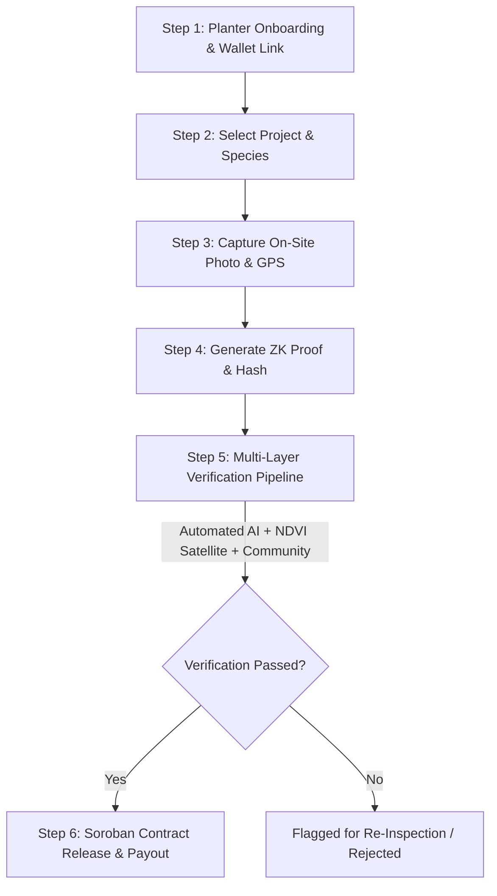

# Planter Onboarding & Tree Verification Guide

Welcome to the **Stellar App OS / Farm Credit Planter Onboarding Guide**. This step-by-step document provides comprehensive guidelines for registered tree planters, field officers, and community verification teams. It details photo submission standards, GPS precision requirements, cryptographic data integrity checks, and the end-to-end multi-layer tree verification workflow powering automated Soroban smart contract payouts.

---

## Table of Contents
1. [Overview & Prerequisites](#overview--prerequisites)
2. [Photo Requirements & Standards](#photo-requirements--standards)
   - [Close-Up Photo Requirements](#close-up-photo-requirements)
   - [Wide-Angle Photo Requirements](#wide-angle-photo-requirements)
   - [EXIF Metadata Requirements](#exif-metadata-requirements)
   - [Common Photo Pitfalls & Rejections](#common-photo-pitfalls--rejections)
3. [GPS Accuracy & Location Standards](#gps-accuracy--location-standards)
   - [Precision & HDOP Thresholds](#precision--hdop-thresholds)
   - [Device Calibration Instructions](#device-calibration-instructions)
   - [Geofencing & Boundary Validation](#geofencing--boundary-validation)
4. [Step-by-Step Tree Verification Process](#step-by-step-tree-verification-process)
   - [Step 1: Account Setup & Wallet Linking](#step-1-account-setup--wallet-linking)
   - [Step 2: Project & Species Selection](#step-2-project--species-selection)
   - [Step 3: On-Site Planting & Media Capture](#step-3-on-site-planting--media-capture)
   - [Step 4: Cryptographic Proof & ZK Hash Generation](#step-4-cryptographic-proof--zk-hash-generation)
   - [Step 5: Multi-Layer Verification Pipeline](#step-5-multi-layer-verification-pipeline)
   - [Step 6: Smart Contract Milestone Payout & NFT Minting](#step-6-smart-contract-milestone-payout--nft-minting)
5. [Verification Flowchart & System Architecture](#verification-flowchart--system-architecture)

---

## Overview & Prerequisites

To participate as a verified tree planter in the Farm Credit ecosystem, planters must register their profile and link a Stellar Ed25519 wallet address. Every tree planted represents a verifiable environmental asset backed by on-chain telemetry, cryptographic zero-knowledge location proofs, and NDVI satellite survival verification.

### Prerequisites Checklist
- [x] Active Stellar Wallet (Freighter, Albedo, or Custodial Keypair)
- [x] Smartphone or GPS camera device with location services enabled
- [x] Approved Planter Registration status on Farm Credit network
- [x] Assigned planting zone / project allocation

---

## Photo Requirements & Standards

Every planted tree submission requires two mandatory photos: a **Close-Up Photo** and a **Wide-Angle Environmental Photo**. Both photos must retain unaltered camera EXIF metadata.

```
       ┌───────────────────────────────┐        ┌───────────────────────────────┐
       │     CLOSE-UP PHOTO            │        │     WIDE-ANGLE PHOTO          │
       │                               │        │                               │
       │  • Leaf detail & bark texture │        │  • Surrounding terrain & land │
       │  • Tree tag / physical marker │        │  • Horizon line visible       │
       │  • Scale reference object     │        │  • Neighboring vegetation     │
       │  • Sharp focus & 1080p+ res   │        │  • Clear sky & natural light  │
       └───────────────────────────────┘        └───────────────────────────────┘
```

### Close-Up Photo Requirements
1. **Subject Focus**: Clear view of the tree sapling, trunk/bark texture, and leaves/foliage.
2. **Physical Tree Tag**: The assigned physical tree tag ID (e.g. `TR-2026-8891`) must be visible attached to or placed immediately next to the sapling.
3. **Scale Reference**: Include a standard scale indicator (e.g., measuring rod, hand, or standard marker) to verify tree height and stem diameter.
4. **Resolution**: Minimum resolution of `1920x1080` pixels (2MP).
5. **Lighting**: Natural daytime lighting. Avoid heavy camera flash reflections or excessive shadows.

### Wide-Angle Photo Requirements
1. **Environmental Context**: Show the tree in relation to its surrounding ecosystem (within a 5-15 meter radius).
2. **Landmarks**: Include permanent natural or physical landmarks (e.g. ridge lines, boundary fences, distinct boulders, neighboring trees).
3. **Orientation**: Landscape orientation preferred to capture context.
4. **Visibility**: No artificial obstruction, blur, or lens obstruction.

### EXIF Metadata Requirements
All submitted photos are validated automatically by the server-side ingestion service. The raw image file **MUST** preserve EXIF headers:
- `GPSLatitude` & `GPSLongitude`: Exact coordinates at the moment of capture.
- `GPSAltitude`: Elevation above sea level.
- `DateTimeOriginal`: UTC timestamp matching the planting window.
- `Make` & `Model`: Smartphone/camera hardware signature.
- `Orientation`: Camera orientation angle.

> [!WARNING]
> Editing, stripping, or re-saving photos through messaging apps (e.g., WhatsApp, Telegram) removes EXIF metadata and will result in **automatic rejection**. Always upload original camera files directly.

### Common Photo Pitfalls & Rejections

| Failure Reason | Description | Remediation |
| :--- | :--- | :--- |
| **Missing EXIF Metadata** | Photo uploaded without embedded GPS/Time headers | Enable GPS tags in camera app settings; upload uncompressed original file |
| **Blurry / Out-of-Focus** | Camera motion or dirty lens obscures leaf/tag details | Wipe camera lens; tap screen to focus before capturing |
| **Duplicate Photo Hash** | Same photo submitted for multiple tree entries | Take unique photos for every individual tree planted |
| **Indoor / Shaded Environment** | Photo taken inside a nursery or under heavy tarp | Capture photo at final outdoor planting site after ground placement |
| **Obstructed View** | Finger, sleeve, or foliage covering the sapling tag | Ensure tag and stem are completely clear and unobstructed |

---

## GPS Accuracy & Location Standards

High-precision GPS telemetry is essential for generating cryptographic location proofs and performing satellite overlap analysis.

### Precision & HDOP Thresholds
- **Required Accuracy**: Horizontal Accuracy **< 5.0 meters** (Ideally < 2.5 meters).
- **Maximum Allowable HDOP (Horizontal Dilution of Precision)**: **≤ 2.0**.
- **Coordinate Format**: WGS 84 (Decimal Degrees, e.g., `Lat: -1.286389, Lon: 36.817223`).

```
                    GPS ACCURACY QUALITY MATRIX
 ┌──────────────────┬──────────────────┬────────────────────────┐
 │ Accuracy (m)     │ HDOP             │ System Acceptance      │
 ├──────────────────┼──────────────────┼────────────────────────┤
 │ 0.0m - 2.5m      │ 0.8 - 1.2        │ EXCELLENT (Auto-Approve)│
 │ 2.5m - 5.0m      │ 1.2 - 2.0        │ GOOD (Standard Review) │
 │ 5.0m - 10.0m     │ 2.0 - 4.0        │ WARNING (Manual Flag)  │
 │ > 10.0m          │ > 4.0            │ REJECTED               │
 └──────────────────┴──────────────────┴────────────────────────┘
```

### Device Calibration Instructions
1. **Enable High Accuracy Mode**: On Android/iOS, turn on "Precise Location" and allow full GPS access for the app.
2. **Clear Sky View**: Stand outdoors away from tall concrete walls, heavy metal roofs, or dense forest canopy until signal stabilizes.
3. **Warm-Up Period**: Allow location services to lock onto satellites for 15-30 seconds before taking the photo.
4. **Check HDOP Indicator**: Wait until the green GPS indicator in the app displays `< 5m precision`.

### Geofencing & Boundary Validation
Plantings are cross-checked against assigned land parcel polygon boundaries defined in the smart contract registry:
- Submissions within project boundaries proceed to automated processing.
- Submissions outside assigned polygons trigger a location variance alert.

---

## Step-by-Step Tree Verification Process



### Step 1: Account Setup & Wallet Linking
1. Register on the Farm Credit portal or mobile web app.
2. Connect your Stellar wallet (Freighter, Albedo, or Custodial).
3. Complete basic KYC / Planter identity verification.

### Step 2: Project & Species Selection
1. Select active planting campaign (e.g. *Reforest Rift Valley 2026*).
2. Choose the specific tree species planted (e.g., *Moringa oleifera*, *Acacia xanthophloea*, *Teak*).
3. System assigns unique tree ID prefix and batch tracking code.

### Step 3: On-Site Planting & Media Capture
1. Plant sapling in accordance with forestry spacing guidelines.
2. Affix physical tree tag.
3. Open planter app camera interface. Confirm GPS signal precision is `< 5m`.
4. Capture Close-Up and Wide-Angle photos.

### Step 4: Cryptographic Proof & ZK Hash Generation
1. App extracts EXIF metadata and constructs location payload: `{lat, lon, alt, timestamp, planter_pubkey}`.
2. Generates Poseidon cryptographic hash and Groth16 zero-knowledge location proof (preventing location spoofing).
3. Uploads encrypted photo payload to private S3 bucket and records hash on-chain.

### Step 5: Multi-Layer Verification Pipeline
Submissions pass through a 3-tier verification pipeline:
1. **Tier 1 - AI Quality & Duplication Filter**:
   - Neural network verifies tree presence, species match, photo clarity.
   - Perceptual hash check prevents duplicate image re-submission.
2. **Tier 2 - NDVI Satellite Ingestion**:
   - Sentinel-2 / Landsat satellite imagery tracks normalized difference vegetation index (NDVI) at coordinates over 30-90 day cycles.
3. **Tier 3 - Community Consensus Verifiers**:
   - Authorized verifiers perform random spot-checks and review flagged entries.

### Step 6: Smart Contract Milestone Payout & NFT Minting
1. Upon successful verification, the `EscrowMilestone` Soroban contract triggers automated release.
2. Stablecoin payment (USDC) or tree tokens are disbursed directly to planter's Stellar wallet address.
3. Soul-bound Tree Asset NFT is minted to track environmental impact history.

---

## Summary Checklist for Field Planters

| Task | Action Required | Status |
| :--- | :--- | :---: |
| **Location Check** | Confirm GPS precision indicator shows < 5m | [ ] |
| **Tag Placement** | Attach legible physical tree tag to sapling | [ ] |
| **Close-Up Capture** | Take sharp photo showing leaves, stem, tag, and scale | [ ] |
| **Wide Capture** | Take environmental photo showing surrounding landmarks | [ ] |
| **Metadata Check** | Upload original uncompressed photo preserving EXIF | [ ] |
| **Submit & Track** | Submit entry and track verification in planter dashboard | [ ] |

---
*For support or technical assistance, contact the Farm Credit verification team at `verification@farmcredit.io` or visit the developer portal at `/api-docs`.*
